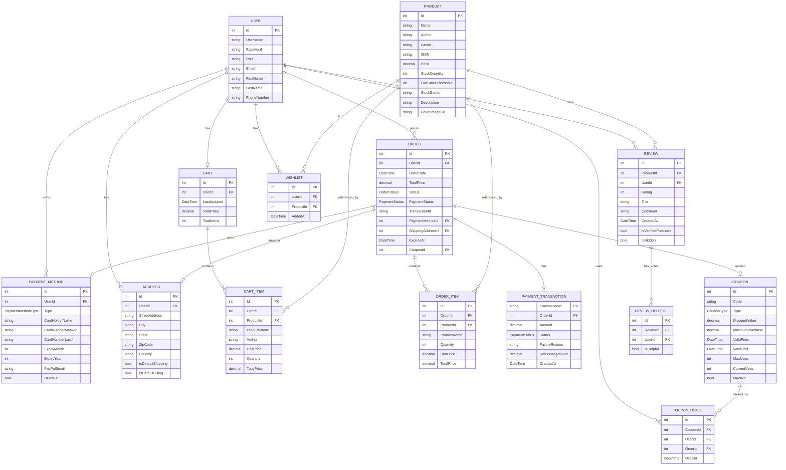

# LittleBugShop Application Flow Diagrams

## 1. Authentication Flow

## 2. Product Browsing & Search Flow

## 3. Shopping Cart Flow

## 4. Two-Step Checkout Flow (Order Creation + Payment)

## 5. Payment Processing Flow

## 6. Payment Method Management Flow

## 7. Order Management Flow (Updated)

## 6. Stock Management Flow (Admin)

## 8. Refund Processing Flow (Admin)

## 9. Complete User Journey Example (Updated with Payments)

## 10. Data Model Relationships (Updated)

## 8. Data Model Relationships

## 11. Authorization Matrix (Updated)

| Endpoint | Anonymous | User | Admin |
|----------|-----------|------|-------|
| **Authentication** |
| POST /api/users/register | ✅ | ✅ | ✅ |
| POST /api/users/login | ✅ | ✅ | ✅ |
| POST /api/users/logout | ✅ | ✅ | ✅ |
| GET /api/session/user | ❌ | ✅ | ✅ |
| **Products** |
| GET /api/products | ✅ | ✅ | ✅ |
| GET /api/products/:id | ✅ | ✅ | ✅ |
| GET /api/products/:id/availability | ✅ | ✅ | ✅ |
| PUT /api/products/:id/stock | ❌ | ❌ | ✅ |
| POST /api/products/:id/stock/increase | ❌ | ❌ | ✅ |
| POST /api/products/:id/stock/decrease | ❌ | ❌ | ✅ |
| **Cart** |
| GET /api/cart | ❌ | ✅ | ✅ |
| POST /api/cart/items | ❌ | ✅ | ✅ |
| PUT /api/cart/items/:id | ❌ | ✅ | ✅ |
| DELETE /api/cart/items/:id | ❌ | ✅ | ✅ |
| DELETE /api/cart | ❌ | ✅ | ✅ |
| **Orders** |
| POST /api/orders/create | ❌ | ✅ | ✅ |
| GET /api/orders/pending | ❌ | ✅ | ✅ |
| DELETE /api/orders/:id/cancel | ❌ | ✅ | ✅ |
| POST /api/cart/checkout | ❌ | ✅ | ✅ |
| POST /api/orders/place | ❌ | ✅ | ✅ |
| GET /api/orders | ❌ | ❌ | ✅ |
| GET /api/orders/my-orders | ❌ | ✅ | ✅ |
| GET /api/orders/:id | ❌ | ✅ | ✅ |
| PUT /api/orders/:id/status | ❌ | ❌ | ✅ |
| DELETE /api/orders/:id | ❌ | ✅ | ✅ |
| **Payment Methods** |
| GET /api/payment-methods | ❌ | ✅ | ✅ |
| GET /api/payment-methods/:id | ❌ | ✅ | ✅ |
| POST /api/payment-methods | ❌ | ✅ | ✅ |
| PUT /api/payment-methods/:id/set-default | ❌ | ✅ | ✅ |
| DELETE /api/payment-methods/:id | ❌ | ✅ | ✅ |
| **Payments** |
| POST /api/payments/process | ❌ | ✅ | ✅ |
| GET /api/payments/transactions | ❌ | ✅ | ✅ |
| GET /api/payments/transactions/:id | ❌ | ✅ | ✅ |
| POST /api/payments/refund | ❌ | ❌ | ✅ |
| GET /api/payments/admin/transactions | ❌ | ❌ | ✅ |
| GET /api/payments/admin/statistics | ❌ | ❌ | ✅ |
| **Profile & Addresses** |
| GET /api/profile | ❌ | ✅ | ✅ |
| PUT /api/profile | ❌ | ✅ | ✅ |
| POST /api/profile/addresses | ❌ | ✅ | ✅ |
| PUT /api/profile/addresses/:id | ❌ | ✅ | ✅ |
| DELETE /api/profile/addresses/:id | ❌ | ✅ | ✅ |
| PUT /api/profile/addresses/:id/set-default-shipping | ❌ | ✅ | ✅ |
| PUT /api/profile/addresses/:id/set-default-billing | ❌ | ✅ | ✅ |
| **Reviews** |
| GET /api/products/:productId/reviews | ✅ | ✅ | ✅ |
| GET /api/products/:productId/reviews/summary | ✅ | ✅ | ✅ |
| POST /api/products/:productId/reviews | ❌ | ✅ | ✅ |
| PUT /api/products/:productId/reviews/:id | ❌ | ✅ (own) | ✅ |
| DELETE /api/products/:productId/reviews/:id | ❌ | ✅ (own) | ✅ |
| POST /api/products/:productId/reviews/:id/helpful | ❌ | ✅ | ✅ |
| PUT /api/products/:productId/reviews/:id/hide | ❌ | ❌ | ✅ |
| **Wishlist** |
| GET /api/wishlist | ❌ | ✅ | ✅ |
| POST /api/wishlist | ❌ | ✅ | ✅ |
| DELETE /api/wishlist/:id | ❌ | ✅ | ✅ |
| POST /api/wishlist/:id/move-to-cart | ❌ | ✅ | ✅ |
| **Coupons** |
| POST /api/coupons/validate | ❌ | ✅ | ✅ |
| GET /api/coupons | ❌ | ❌ | ✅ |
| POST /api/coupons | ❌ | ❌ | ✅ |
| PUT /api/coupons/:id | ❌ | ❌ | ✅ |
| DELETE /api/coupons/:id | ❌ | ❌ | ✅ |
| GET /api/coupons/usage-report | ❌ | ❌ | ✅ |

## 12. Stock Status State Machine

## 13. Order Status Lifecycle (Updated with Payments)

## 14. Payment Status Lifecycle

## Key Features Summary

### User Features:
- ✅ Register/Login with JWT authentication
- ✅ Browse and search products (by name, author, genre, price)
- ✅ Check product availability and stock status
- ✅ Manage shopping cart (add, update, remove items)
- ✅ **Two-step checkout** (create order → process payment)
- ✅ **Manage payment methods** (Credit/Debit cards, PayPal)
- ✅ **Process payments** with test card patterns
- ✅ **Retry failed payments** (cart preserved)
- ✅ **Cancel pending orders** (stock restored)
- ✅ View order history with payment status
- ✅ View transaction history
- ✅ **User profile management** (personal info, addresses)
- ✅ **Multiple addresses** (shipping/billing, default settings)
- ✅ **Write and manage reviews** (ratings, comments, verified purchase badge)
- ✅ **Vote on reviews** (helpful/not helpful)
- ✅ **Wishlist management** (add, remove, move to cart)
- ✅ **Apply discount coupons** (percentage/fixed, validation)
- ✅ Stock validation prevents over-ordering

### Admin Features:
- ✅ All user features
- ✅ View all orders in system
- ✅ Update order status (Pending → Processing → Shipped → Delivered)
- ✅ Cancel orders (with automatic stock restoration)
- ✅ **Issue refunds** (full/partial, stock restoration)
- ✅ **View all transactions** with filtering
- ✅ **Payment statistics** (revenue, success rate, failure reasons)
- ✅ Manage product stock (set, increase, decrease)
- ✅ **Hide/unhide reviews** (moderation)
- ✅ **Manage coupons** (create, edit, delete, usage reports)
- ✅ Full inventory control

### System Features:
- ✅ JWT authentication (cookie + header support)
- ✅ Role-based authorization (Admin vs User)
- ✅ **Two-step checkout flow** (order creation + payment processing)
- ✅ **Payment simulation** with test card patterns (7 failure scenarios)
- ✅ **Payment retry logic** (cart preservation on failure)
- ✅ **15-minute order expiration** for pending orders
- ✅ **Automatic stock restoration** on cancellation/refund
- ✅ **Transaction audit trail** (success and failure tracking)
- ✅ **Multiple payment methods** per user
- ✅ **Secure card storage** (masked numbers, last 4 digits only)
- ✅ Real-time stock availability checking
- ✅ Shopping cart persistence per user
- ✅ Order status tracking with payment integration
- ✅ **Review verification** (verified purchase badge)
- ✅ **Review helpfulness voting** (community feedback)
- ✅ **Coupon validation** (expiry, usage limits, minimum purchase)
- ✅ **Address management** (multiple addresses, default settings)
- ✅ Computed properties (prices, totals, stock status, review statistics)

### Test Automation Features:
- ✅ **Deterministic payment outcomes** (test card patterns)
- ✅ **Predictable failure scenarios** (7 distinct failure types)
- ✅ **Comprehensive HTTP test files** (60+ payment scenarios, 40+ review scenarios, etc.)
- ✅ **Stock simulation** (low stock warnings, out of stock handling)
- ✅ **Time-based scenarios** (order expiration, coupon validity)
- ✅ **Multi-user testing** (3 seeded users with different roles)
- ✅ **Complete API coverage** (80+ endpoints across 11 controllers)
